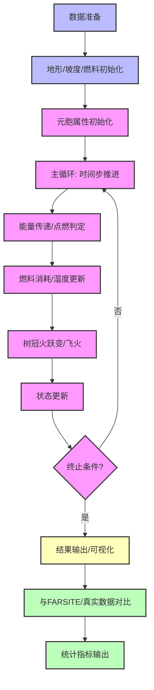

# PLAN-1-fire-spread-model-todolist

## 任务分解 ToDoList

- [x] 1.1 详细梳理题目三问的输入、输出、约束条件
- [x] 1.2 明确各问的简化与复杂程度（如有无风、理想地形、真实地形等）
- [x] 2.1 明确元胞自动机（CA）多层结构（地表层/树冠层）及其物理意义
- [x] 2.2 设计元胞的静态属性与动态属性数据结构
- [x] 2.3 推导并明确火蔓延速度 $R_{i\to j}$ 的统一物理引擎公式
- [x] 2.4 梳理各影响因子（坡度、风、湿度、可燃物等）及其参数化方式
- [x] 2.5 设计模拟演化规则（能量传递、点燃、燃料消耗、湿度变化、树冠火跃变、飞火等）
- [x] 3.1 选定编程语言与主要依赖库（Python+NumPy/Matplotlib等，见下）
- [x] 3.2 设计元胞类/结构体，定义属性与方法
- [x] 3.3 实现地形生成与初始化（理想平面/坡面、DEM数据读取）
- [x] 3.4 实现元胞自动机主循环（时间步推进、状态更新）
- [x] 3.5 实现火蔓延速度与能量传递的物理引擎
- [x] 3.6 实现燃料消耗、湿度动态、树冠火跃变、飞火等模块
- [x] 3.7 参数配置与模型简化开关（便于针对不同问题切换）
- [x] 4.1 问题一：无风、理想平面/坡面，简化模型，设置起火点，模拟24/48/72小时火场范围
- [ ] 4.2 问题二：引入风向风力，调整模型参数，重复模拟
- [ ] 4.3 问题三：真实地形数据处理（ArcGIS/DEM），全功能模型，设定起火点与风，模拟火场范围
- [ ] 5.1 设计火场蔓延范围的可视化方案（2D/3D图、动画等）
- [ ] 5.2 输出24/48/72小时火场边界图
- [ ] 5.3 分析不同条件下的蔓延特征与模型合理性
- [ ] 6.1 关键参数（如坡度、风速、湿度等）敏感性分析
- [ ] 6.2 与文献/实际案例对比，验证模型合理性
- [ ] 7.1 整理建模流程、公式推导、参数说明
- [ ] 7.2 总结模型优缺点、适用范围与改进方向

---

## 工程实现建议

- **主力语言**：Python
- **必备依赖**：NumPy, SciPy, rasterio, pyproj, shapely, geopandas, Matplotlib, Plotly, Numba, scikit-learn, scikit-image, imageio
- **结构建议**：/core/（CA主循环）、/data/（输入）、/utils/（地理/统计工具）、/viz/（可视化）、/experiments/（参数配置）、/validation/（对比与指标）
- **关键实现要点**：
  - 元胞属性与状态用NumPy结构化数组或自定义类
  - 三维风-坡耦合用NumPy矢量化实现
  - 动态湿度与能量传递用Numba加速
  - 参数化与校准用YAML/JSON配置
  - 地形用rasterio/GDAL读取DEM
  - 可视化自动输出火场边界、动画，并与FARSITE/真实数据对比

---

## Mermaid 流程图

---

## 状态历史

- 2024-06-10 创建计划，初始任务分解与工程建议。 

---

## 1. 编程语言选择

- **推荐主力语言：Python**
  - Python在科学计算、地理空间数据处理、可视化和高性能数值模拟领域有极为丰富的生态。
  - 便于快速原型开发、参数调优和可视化，适合竞赛和学术研究。
  - 便于后续与ArcGIS、DEM等地理数据平台对接。
- **可选补充**：
  - 对于极大规模模拟或并行需求，可用Cython、Numba、或PyCUDA加速，或用C++/Fortran重写核心模块（如有必要）。

## 2. 主要依赖库

### 2.1 数值计算与数组操作
- **NumPy**：高效的多维数组与矩阵运算，支持矢量化，极大提升CA模拟效率。
- **SciPy**：用于科学计算、插值、优化等。

### 2.2 地理空间数据处理
- **GDAL / rasterio**：读取、写入和处理DEM、栅格地形数据。
- **pyproj**：地理坐标投影转换。
- **shapely**：空间几何对象处理（如火场边界多边形提取）。
- **geopandas**：空间数据表格化处理，便于与shapefile、GeoJSON等格式交互。

### 2.3 可视化
- **Matplotlib**：2D绘图，适合火场蔓延过程、边界等静态图展示。
- **Plotly**：交互式2D/3D可视化，适合动态演示和竞赛展示。
- **mpl_toolkits.mplot3d**：3D地形与火场可视化。
- **imageio**：生成火蔓延过程动画（GIF/MP4）。

### 2.4 性能优化
- **Numba**：JIT编译，极大加速核心循环（如能量传递、状态更新）。
- **joblib / multiprocessing**：多核并行，适合大规模网格模拟。

### 2.5 参数管理与实验记录
- **hydra / OmegaConf**：参数配置与实验管理，便于批量实验与复现实验结果。

### 2.6 统计与验证
- **scikit-learn**：Kappa系数、Sørensen-Dice系数等空间统计指标实现。
- **scikit-image**：图像处理与空间重叠度计算。

### 2.7 ArcGIS/DEM对接
- **arcpy**（如有ArcGIS授权）：直接与ArcGIS平台交互。
- **open3d**（可选）：三维点云与地形可视化。

## 3. 代码结构建议

- **/core/**：元胞自动机核心模块（Cell类、CA主循环、物理引擎等）
- **/data/**：地形、燃料、气象等输入数据
- **/utils/**：地理数据处理、参数管理、统计分析等工具
- **/viz/**：可视化脚本与模板
- **/experiments/**：参数配置、批量实验脚本
- **/validation/**：与FARSITE等模型对比、Kappa/DSC等指标计算

## 4. 关键工程实现要点（结合增强报告）

- **元胞属性与状态**：用NumPy结构化数组或自定义类，支持静态/动态属性分离。
- **三维风-坡耦合**：用NumPy矢量化实现三维点积与方向修正，提升效率与物理精度。
- **动态湿度与能量传递**：用Numba加速能量累积、湿度更新等核心循环。
- **参数化与校准**：参数文件（YAML/JSON），支持文献参数与灵敏度分析。
- **地形与空间数据**：用rasterio/GDAL读取DEM，自动计算坡度、坡向等属性。
- **可视化与验证**：自动输出火场边界、蔓延动画，并与FARSITE/真实数据对比，输出Kappa/DSC等指标。

--- 